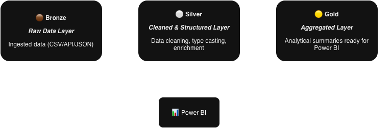

# 👨‍💻 Data Analytics & Engineering Portfolio  

**Author:** Dhananchezhiyan  
**Role:** QA Engineer (BI & ETL Tester) | Aspiring Data Engineer & Analytics Specialist  

---

## 📘 Overview  
This repository showcases **end-to-end Data Engineering & Analytics projects** built on **Microsoft Fabric**, leveraging **PySpark**, **Dataflows**, and **Power BI**.  
Each project implements the **Medallion Architecture (Bronze → Silver → Gold)** for structured data transformation, storage, and business-ready analytics.  

Projects included:  
1. **Instacart E-commerce Pipeline** — Advanced Fabric-based ELT solution modeling 32M+ records into a Star Schema for customer and order analytics.  
2. **Financial Analytics Project** — A structured ETL and analytics workflow transforming financial data for profitability insights.  
3. **Earthquake Analytics Project** — A real-world API-to-visualization pipeline integrating USGS earthquake data with reverse geocoding.  

---

## 🏗️ Medallion Architecture Overview  
  

---

## 🧩 Technologies Used  
- **Microsoft Fabric Lakehouse (OneLake, Direct Lake)**  
- **PySpark (Spark SQL, DataFrame API)**  
- **Dataflow Gen2 (Low-Code ELT)**  
- **Power BI (Visualization, DAX, Semantic Modeling)**  
- **Delta Lake Format**  
- **Python (UDFs, API Ingestion, Data Cleaning)**  
- **Dimensional Modeling (Star / Snowflake Schema)**  

---

## 🚀 Portfolio Projects  

### 🛒 Instacart E-commerce Pipeline *(Advanced Project)*  
**Objective:**  
Design and implement a scalable Analytics Engineering pipeline to transform **32 million Instacart transaction records** into a clean, query-optimized **Star Schema** for customer purchase and logistics analysis.  

**Key Highlights:**  
- **Hybrid ELT:** Used **Dataflow Gen2** for dimension cleansing and **PySpark notebooks** for large-scale fact table joins and schema enforcement.  
- **Data Governance:** Applied strict type casting and handled missing values (e.g., `days_since_prior_order`) across 32M+ rows.  
- **Semantic Modeling:** Created analytical measures like **Products Per Order (PPO)** and **Total Sales** using DAX in Power BI.  
- **Delivery:** Published a professional Power BI dashboard visualizing **hourly order peaks, product demand trends, and customer frequency** using **Direct Lake connectivity**.  

📄 [View Dashboard (PDF)](Instacart_Analytics/report/RPT_Instacart_Dashboard.pdf)  

---

### 💰 Financial Analytics Project  
**Objective:**  
Transform raw sales data (with currency symbols, nulls, inconsistent formats) into analytical tables showing key business metrics like **Profit Margin %**, **Sales**, and **COGS** trends.  

**Key Highlights:**  
- Cleaned financial data using **PySpark** and handled inconsistent formatting using `regexp_replace`.  
- Derived `profit_margin_percentage = (profit / sales) * 100`.  
- Designed an interactive **Power BI Dashboard** with filters, date hierarchy, and segment-level insights.  

📄 [View Dashboard (PDF)](Financial_Analytics/Financial_Analytics.pdf)  

---

### 🌎 Earthquake Analytics Project  
**Objective:**  
Ingest, process, and analyze **USGS real-time earthquake data** using Fabric and PySpark, enriched with country mapping and significance classification.  

**Key Highlights:**  
- Data ingestion via **Python requests** from the USGS API.  
- Flattened nested JSON (geometry + properties).  
- Enriched data with **reverse geocoding** for country names and classified events by significance (`Low`, `Moderate`, `High`).  
- Stored final curated dataset in **Delta Gold table** for visualization in Power BI.  

📄 [View Dashboard (PDF)](Earthquakes_Analytics/Earthquake_Events.pdf)  

---

## 🧠 Concepts Demonstrated  
✅ Medallion Architecture (Bronze / Silver / Gold)  
✅ Delta Tables & Schema Handling (`mergeSchema`, `overwriteSchema`)  
✅ PySpark Transformations (`withColumn`, `groupBy`, `cast`)  
✅ Data Cleansing & Governance  
✅ Star Schema & Semantic Modeling  
✅ Power BI Integration with Fabric Lakehouse  

---

## 👤 Connect with Me  
  

---
